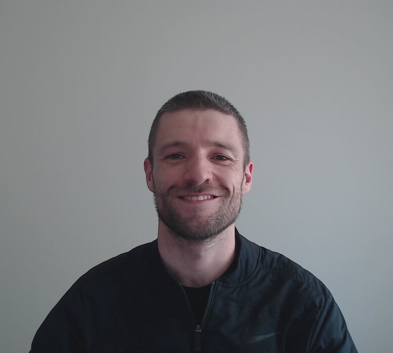

<h2 align="center" style="margin-top: 0px;">
Toadally Legit Quiz 

</h2>

What is your new favorite Hoppy? Come find out with this super accurate, highly scientific quiz. Once you find your spirit sad frog, learn about all the new hoppys you can try with all of your new froggy friends. Then post your results on Twitter to expand your chorus of frogs!
  

[Find Your Spirit Sad Frog Now](https://toadally-legit-quiz.netlify.app/)

The incredible artwork for this project was graciously provided by [Cristina Aucone](http://www.cristinaaucone.com/)!
 
 
©2021 SadFrogTM Cristina Aucone/Rootbound LLC. All rights reserved.

## Background

Toadally Legit was an app built over a 24-hour period during the 2021 Road to Code Hackathon, Powered by [Driveway](https://www.driveway.com) and Hosted by [Alchemy](https://www.alchemycodelab.com). The app was build with React, Context API, TailwindCSS, and hosted on Netlify. We wanted to build a fun, interactive quiz that would help bring people together and encourage them to try out new hobbies in a new, totally scientific way.

## Meet the Toads Behind the Quiz

<h3>Josie Cantu</h3>

Josie M. Cantu is a Software Engineer who is driven by her curiosity and desire to develop her skills. She thrives in a team setting and loves collaboration. She is a dog lover and dog mom to Noey.

<h3>Juli Vela</h3>

Juli is a quirky, neurodiverent software engineer based out of beautiful Bandon-By-The-Sea in Southern Oregon! Driven by their passion for learning and creativity, they strive to stay active and current with new technologies. Using their unique perspective of the world, they enjoy combining their passions for astronomy, creativity, and social wellbeing, with their love and expertise in software development.

<h3>Nicole Martin</h3>

Nicole is a full stack software engineer located in Portland, OR. She enjoys working with computers and collaborating on fun and impactful projects that will help the planet, animals, and all humans. Also a huge fan of vegan food, coffee and being outside in the beautiful Pacific Northwest with her dog, Cooper.

<h3>Patrick Hrabos</h3>

Lorem ipsum dolor sit amet, consectetur adipiscing elit. Ut nec varius lectus. Integer in scelerisque est, quis finibus ex. Phasellus egestas libero non libero pulvinar sodales. Vestibulum nisl neque, commodo vitae leo nec, gravida convallis metus. Pellentesque molestie non felis et tempus.

<h3>Paul Brubaker</h3>

Paul is a full stack software engineer who loves to collaborate on interesting problems.

## Attributions and Credits

Icons made by <a href="https://www.flaticon.com/authors/roundicons" title="Roundicons">Roundicons</a> from <a href="https://www.flaticon.com/" title="Flaticon">www.flaticon.com</a>

